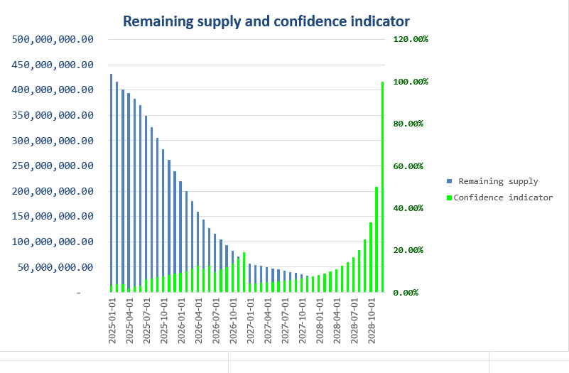

## Automated-Token-Release-Schedule-System
This project is an innovative solution for automating the token release schedule for early-stage cryptocurrency projects. Designed to streamline the process, this system ensures accurate daily token distribution in compliance with release schedules typically outlined in white papers. By leveraging advanced data science methodologies, this project empowers cryptocurrency projects to maintain transparency and efficiency.

✨ Key Features

✅ Automated Token Release: Generates daily schedules for token distribution based on predefined criteria.

📊 Custom Indicators: Incorporates indicators derived from white papers, ensuring compliance and precision.

⚙️ Scalable Design: Suitable for various tokenomics models and adaptable to different cryptocurrency projects.

📝 User-Friendly Output: Provides clear, concise schedules that are easy to integrate into project workflows.

 Indicators and Methodology

The system uses a set of indicators commonly mentioned in cryptocurrency white papers to calculate the token release schedule. These indicators include:

⏳ Token Vesting Periods: Defines the time period over which tokens are gradually released.

📈 Cliffs and Linear Releases: Incorporates delays (cliffs) and consistent release patterns.

📤 Proportions Allocated: Considers allocations to stakeholders such as team members, investors, and the community.

Using Python, we built a flexible framework that parses input parameters and computes daily release amounts with accuracy.

🧪 Example Workflow

Define the tokenomics parameters in the provided input fields.

Use the implemented indicators to calculate daily release schedules.

Export the schedule as a CSV or other desired format.

👨‍💻 About the Author

This project was developed by Mojtaba, a data scientist at Virtual Finance Company. With a strong background in data analysis and finance, Mojtaba created this system to bring transparency and automation to the cryptocurrency space.

📜 License

This project is licensed under the MIT License, allowing others to use, modify, and distribute the system with appropriate credit.

🌟 Get Involved

We hope this project inspires others to innovate in the cryptocurrency and blockchain space. Contributions and feedback are welcome!

- **File Format**: [📘TOKEN.ipynb](TOKEN.ipynb)

## Indicators

 
